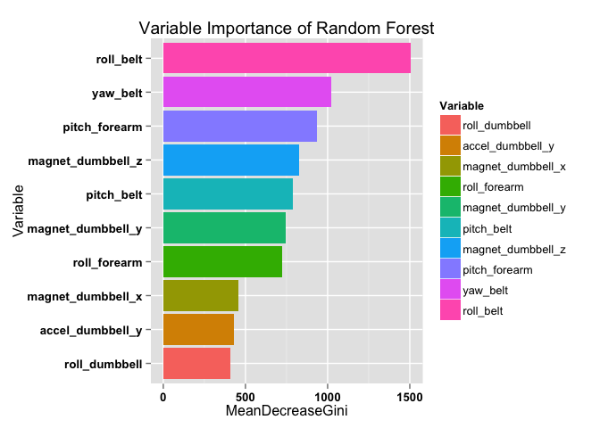

# Predicting Wellness of Exercises
Zhengkan Yang  
May 19, 2015  
#Summary
In this project, we examined the effects of exercise behaviors on the exercise qualities, using the data of measurements collected from wearable devices.  We applied two predictive algorithms-__decision tree__ and __random forest__, and finally decided to use __random forest__ with 13 variables resampled at each split as our final model, which has a cross-validation accuracy __0.99__.  
The final model shows that __roll_belt__, __yaw_belt__ and __pitch_forearm__ are the most influential variables impacting the quality of exercise.


#Load the libraries
For this exercise,  we will primarily use `dplyr` for data manipulation, `caret` for model building, `ggplot2` for data visualization

```r
require(dplyr)
require(caret)
require(ggplot2)
```

#Read the Data
The first column and second column are timestamps and new_window, num_window variable which are not quite useful here, so we delete them.

We did not delete userName variable because there could be user-level confounding effect which will impacts the response (for instance, some users may be more likely to give a better exercise than others)

```r
training <- read.csv('pml-training.csv', sep = ',',na.strings = c('','NA'))
training <- training[,-c(1,3:7)]
training$user_name <- factor(training$user_name)
```

#Data Exploration
In this section, we explore the datasets by plotting the distribution of variables and search for the irregularities which needs to be addressed by appropriate preprocessing method

##Missing Values
There are 67 variables each of which have 98% missing values. With such a high percentage of NAs, doing imputation would be both too **computationally costly** and **highly biased**. Including them in the data will also reduce model performance. Therefore, the best way is to **delete all of these variables**.

```r
missing_percent <- data.frame(VarName <- names(training), Pct <- 0.0) 

for(i in 1:length(names(training))){
    missing_percent$Pct[i] <- sum(is.na(training[,i]))/nrow(training)
}
missing_percent <- missing_percent[,c(1,3)]
names(missing_percent) <- c('Vars','Pct')
 
#Delete all of the variables
training <- training[,-which(missing_percent$Pct > 0.5)]
```

##Variables with nearZero variance
The variables with much less unique values than the total number of observation, as well as a huge imbalance between the most frequent value and the second most frequent value, should be removed because they have insignificant predictive power.

To be more conservative and not losing too much information, I use **freqCut = 99/1** and **uniqueCut = 10** as cutoff points, which resulted in **24** variables to be removed.

```r
nsv <- nearZeroVar(training,saveMetrics=TRUE,freqCut = 99/1, uniqueCut=10 )
if (length(which(nsv$nzv)) > 0){
    training <- training[,-which(nsv$nzv)]
}
```

##Check response class balance
Imbalance check in response variable is conducted to see if balancing technique such as undersampling/oversampling methods need to be applied before modeling.  
As the result shows, there is not a huge imbalance among response levels. So we do not need to apply balancing methods.

```r
training$classe <- factor(training$classe)
res_percent <- training %>% group_by(classe) %>% summarise(Percentage = n()/nrow(training))
ggplot(data=res_percent, aes(x = classe, y = Percentage)) + geom_bar(aes(fill = classe),stat='identity') + ggtitle('Percentage of exercise wellness levels') + xlab('Classe') + ylab('Percentage')
```

 

#Model Training and Selection
We applied two models here:  
*Decision Tree Classification
*Random Forest

In order to reduce the risk of overfitting, we applied 10-fold repeated cross-validation on the training set and use the same folds across three models. The purpose of repeated cross-validation is to test the stability of model performance, i.e. whether the model have close accuracy metrics across different samples.


###Specify training control function

###Set up training control methods
We enable Parallel processing and random seeds here to give three methods the same set of folds for training.

```r
set.seed(123)
seeds <- vector(mode = "list", length = 51)
for(i in 1:50) seeds[[i]] <- sample.int(1000, 22)
fitControl <- trainControl(method = 'cv',number=10,allowParallel= TRUE,seeds=seeds)
```

###Classification Tree

```r
parGrid = expand.grid(cp = c(0.001,0.01,0.1))
CTree <- train(classe~.,data=training, trControl = fitControl, tuneGrid = parGrid,method = 'rpart')
final_tree <- CTree$finalModel
```

###Random Forest


```r
library(doMC)
registerDoMC(core=5)
number_of_var = length(names(training)) - 1
parGrid = expand.grid(mtry = c(floor(sqrt(number_of_var)),floor(number_of_var/3), floor(number_of_var/4)))
rForest <- train(classe~.,data=training,trControl = fitControl,tuneGrid=parGrid,method = 'rf',allowParallel = TRUE)
final_rForest <- rForest$finalModel
```


###Final Model Determination
From the final results of these three models, random forest with 13 variables resampled at each split performs better at nearly 99% classification accuracy with similar variance.  

The variable importance figure shows that the __roll_belt__, __yaw_belt__ and __pitch_forearm__ are the three most important variables determining the qualities of exercise.


```r
load('../.RData')
res_rf <- rForest$results[1,]
res_tree <- CTree$results[1,]
metrics <- data.frame(Model=c('Random Forest','Decision Tree'),importance = rbind(res_rf[,2:5],res_tree[,2:5]))
metrics
```

```
          Model importance.Accuracy importance.Kappa importance.AccuracySD
1 Random Forest           0.9966364        0.9957452          0.0009968378
2 Decision Tree           0.9040877        0.8785978          0.0087942896
  importance.KappaSD
1        0.001261066
2        0.011148416
```

```r
final_rForest = rForest$finalModel
#Variable Importance
varImportance= data.frame(Variable = row.names(final_rForest$importance),final_rForest$importance)
varImportance = varImportance %>% arrange(desc(MeanDecreaseGini))

varImportance$Variable <- ordered(varImportance$Variable,levels = varImportance$Variable[order(varImportance$MeanDecreaseGini,decreasing=FALSE)])

ggplot(data=varImportance[1:10,],aes(x = Variable, y = MeanDecreaseGini)) + geom_bar(aes(fill = Variable),stat = 'identity') + coord_flip() + ggtitle('Variable Importance of Random Forest') + theme(axis.text = element_text(colour = 'black',face='bold',size=10))
```

 


##Model Testing
The best model is applied to 20 test cases to produce results

```r
testing <- read.csv('pml-testing.csv',na.strings = c('NA',''),header=TRUE)

answers = as.character(predict(rForest,newdata=testing))
pml_write_files = function(x){
    n = length(x)
   for(i in 1:n){
    filename = paste0("results/problem_id_",i,".txt")
    write.table(x[i],file=filename,quote=FALSE,row.names=FALSE,col.names=FALSE)
   }
 }
 pml_write_files(answers)
```


